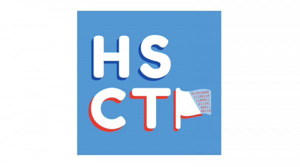

# HSCTF-2020-Writeup

  

## Overview

| Miscellaneous       | Web              | Crypto     | Reverse Engineering                 | Forensics      | Binary Exploitation                  | Algorithms                 |
| ------------------- | ---------------- | ---------- | ----------------------------------- | -------------- | ------------------------------------ | -------------------------- |
| Does CTFd Work?     | Blurry Eyes      | Unexpected | AP Lab: Computer Science Principles | Comments       | Intro to Netcat 2: Electriv Boogaloo | Pythagorean Tree Fractal 1 |
| Discord Flag        | Inspector Gadget | XORed      | AP Lab: English Language            | Mad Libs       |                                      | Pythagorean Tree Fractal 2 |
| My First Calculator | Very Safe Login  |            |                                     | Meta Mountains |                                      |                            |
|                     |                  |            |                                     |                |                                      |                            |
